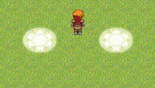

# Flat Characters
There is an annoying issue in RPG Maker XP that has been fixed in subsequent versions: you can't put events with big character sprites "below" the hero.

Let's say for example you want to make a big magic circle on the floor, so the player can walk on it. Unfortunately, RPG Maker XP displays it as a "wall" instead of sticking it to the floor. As an effect of this, you walk behind the circle instead of walking on it.

This script is meant to solve this issue. Simply add it above the Main script and to make a character have the flat/below hero behavior, just put _\_flat_ in the file name. This tag can be changed in the script.

### Demonstration (courtesy of FoxFiesta)

On the left, _199-Support07.png_. On the right, _199-Support07_flat.png_.

