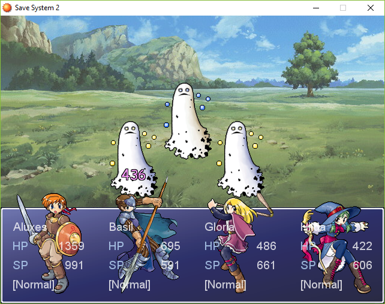

# RPG::Sprite
This class is used in RPG Maker XP with battlers and characters, to display effects such as damage, animations, and various other things. It is not accessible through the editor but can be reached using the Help file (F1).

## RPG::Sprite (Rewrite)
This is a script that rewrites the core class RPG::Sprite for RPG Maker XP. The structure has been inspired from Sprite_Base from RPG Maker VX Ace, along with a few additions. All effects from this script are the ones already in RPG Maker XP.

Some constants have been added at the beginning of the script for **non-scripters** to change a few things:
* Text for missed attacks and critical hits.
* Text font and color for all types of damage displayed on screen
  * Normal damage
  * Recovery damage
  * Critical hits
  * Missed attacks

It is also easier now for **scripters** to use aliases or edit methods in subclasses without altering the main class.

### Screenshots

Normal damage color change

Critical damage text and color change

## RPG::Sprite (Ace Style)
This second script is a little extension that should be updated over time. It imports a few effects from RPG Maker VX Ace into XP.
- Different colors for whiten and collapse effects
- A special boss_collapse effect (to set an enemy as a boss, follow the instructions in the script), together with sound.

### Screenshots

Boss collapse effect from VX Ace
